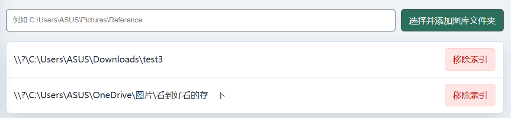
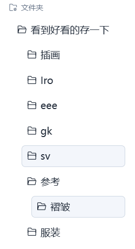
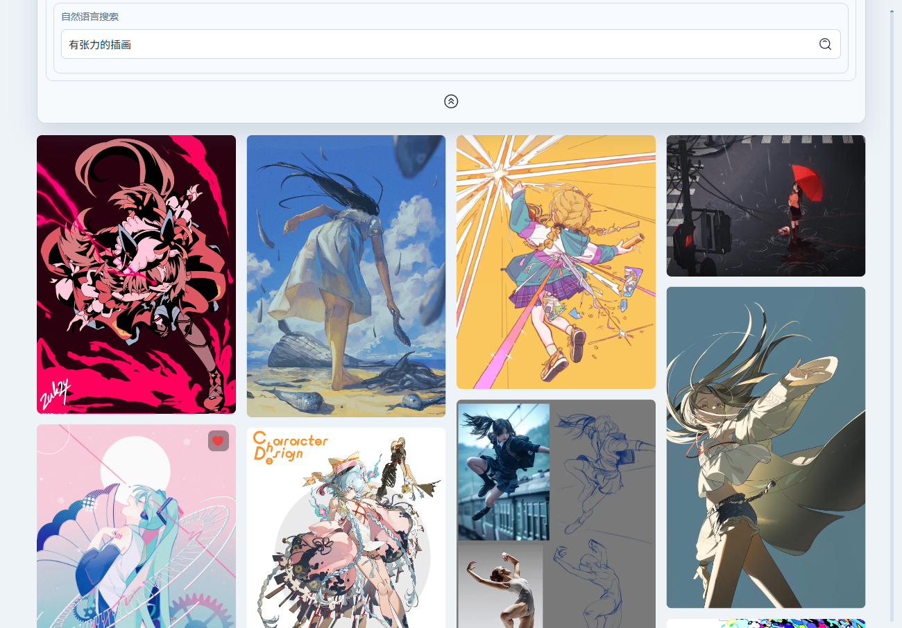
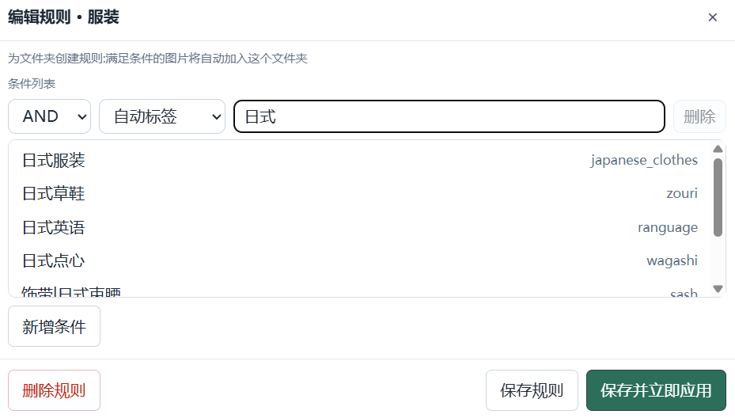
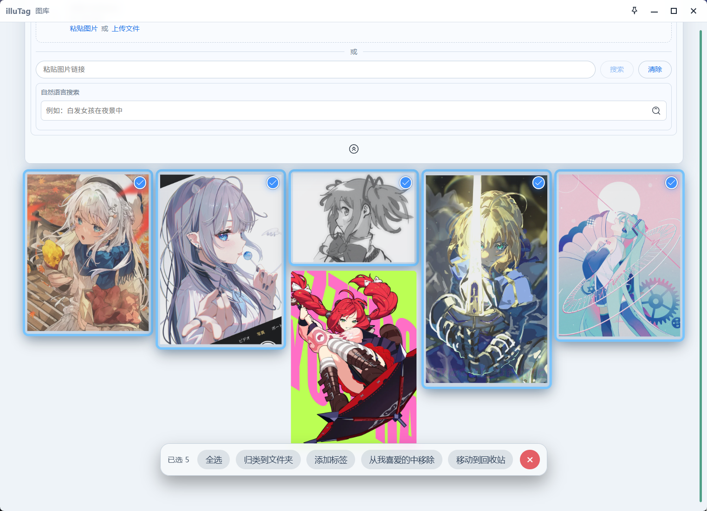
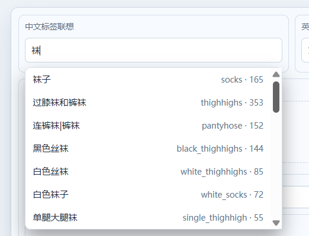

# illuTag

illuTag 是一个面向二次元创作者、插画师、原型师、插画囤积癖等用户的参考图整理和本地图像管理工具。

它基于 Tauri、Vue 3、Rust、SQLite 和本地 ONNX 推理构建，重点是快速浏览本地图像、整理参考图、维护参考板、使用 Danbooru 风格标签管理图片，并通过本地模型提供自然语言搜图和以图搜图能力。用户图片不会上传到远程服务，主要功能都在本地运行。

> 演示视频：待补充
## 下载
在右边的Releases下载完整的包体，或克隆本仓库自行配置环境。
## 说人话

illuTag 可以管理你辛辛苦苦从x、pixiv、小红书等等地方存下来的图片，并为它们自动生成标签，例如“白色头发”“初音未来”“黑色丝袜”“蝴蝶结”“魔法少女”等。

当你只输入“白色”时，它也可以联想出“白色头发”“白色背景”“白色连衣裙”等标签，防止你根本不知道图库里有什么标签。

`selected_tags_full_translation.csv` 包含约 10000 条用于自动生成的标签。中文翻译一部分来自网络，一部分来自 ChatGPT 翻译；我校对了其中最为高频的2000条通用标签和2、3000条角色标签，基本上以donmai.moe的wiki为准。

如果要找的东西不好用标签描述，例如“夏日海滩边喝饮料的红发美少女”，可以直接使用自然语言搜索。结果越靠前，通常越接近描述。

如果你不知道怎么描述，可以尝试以图搜图。

内置模型主要是成熟的开源模型，不一定认识最新角色。对于没有角色标签的图片，可以先用以图搜图找到相似图片，再批量添加自定义标签。自然语言搜索建议使用指向明确的描述，避免过于含糊或多义的句子。

如果想把图片当作参考，可以把图片拖到右侧栏的参考板中。参考板支持窗口置顶，适合与ps、csp、zb等软件一起使用。也可以从其他网站直接拖入图片，并进一步保存到本地图库。

如果你只想舔图，右上角点击“最大化”，然后滚动滚轮。我用了效率不是很高的瀑布流算法，但很好看。

如果你不知道如何使用这个软件，可以长按拖拽一下，很多功能都通过拖拽来实现。

## 功能截图

### 界面概览


### 导入本地图像

支持按本地目录生成对应的文件夹分类。
（为防止冲突，该功能仅在首次导入时可使用）





### 虚拟化瀑布流浏览


### 自动标签

支持为图片生成角色标签与通用标签。


### Chinese-CLIP 搜索

支持自然语言搜图与以图搜图。




### 用户文件夹与规则

可以根据标签规则将图片自动归类到文件夹。



### 参考板

参考板支持拖拽、粘贴、复制、导出、缩放、旋转和自动排列。


可以将图片自由拖入右侧参考板。


### 批量操作

支持喜爱图片、批量移动、批量添加标签等操作。



### 标签搜索与中文联想



### 相似搜索

支持配色相似、氛围相似等辅助搜索。


## 功能概览

- 本地图像图库索引
- 虚拟化瀑布流浏览
- 用户文件夹与文件夹规则
- 参考板：拖拽、粘贴、复制、导出、缩放、旋转、自动排列
- 软件内回收站与本地删除
- 喜爱图片与批量操作
- Danbooru 标签搜索与中文标签联想
- 基于 WD tagger 的自动打标
- 基于 Chinese-CLIP 的自然语言搜图与以图搜图
- 配色相似、氛围相似等辅助搜索
- 分发版支持内置 Python runtime，解压即用

## 当前状态

项目仍在活跃开发中。图库、文件夹、参考板、标签、搜索和基础分发流程已经可用，但数据结构、打包方式和部分交互仍可能继续调整。（大概吧）

## 仓库内容

源码仓库不会包含大型运行资源。

仓库包含：

- Tauri / Vue / Rust 源码
- 本地 ONNX 推理所需的 Python 服务脚本
- `wd-swinv2-tagger-v3/selected_tags.csv`
- `wd-swinv2-tagger-v3/selected_tags_full_translation.csv`
- 便携版打包脚本

仓库不包含：

- ONNX 模型权重
- Chinese-CLIP 模型文件
- 内置 Python runtime
- 便携版 release 压缩包
- 本地数据库、缓存和用户数据

## 开发运行

安装依赖：

```powershell
npm install
```

开发模式运行：

```powershell
npm run tauri dev
```

构建 release 可执行文件：

```powershell
npm run tauri build
```

release 可执行文件通常会生成在：

```text
src-tauri/target/release/
```

## 本地数据

illuTag 默认使用 Tauri 的应用数据目录保存用户数据。

在 Windows 上通常是：

```text
%AppData%\com.sunriseworks.illutag
```

图库索引数据库会保存为：

```text
illutag.sqlite
```

删除或替换程序本体不会自动删除这个目录。

## OnnxRuntime 与模型

打标功能需要本地模型和运行环境，这些文件不会随源码仓库提供。

推荐的便携版目录结构：

```text
illuTag/
  illutag.exe
  runtime/
    python/
      python.exe
      Lib/
      ...
  scripts/
    wd_tagger_service.py
    chinese_clip_text_service.py
    chinese_clip_image_service.py
  wd-swinv2-tagger-v3/
    model.onnx
    selected_tags.csv
    selected_tags_full_translation.csv
  model/
    chinese-clip-vit-base-patch16/
      vocab.txt
      onnx/
        chinese_clip_text_encoder.onnx
        chinese_clip_image_encoder.onnx
```

程序会优先使用可执行文件同级的：

```text
runtime/python/python.exe
```

如果没有找到内置 Python runtime，则会回退到系统 `PATH` 中的 `python`。

## 便携版打包

准备好 release 可执行文件、runtime、脚本和模型文件后，可以运行：

```powershell
.\scripts\package-portable.ps1 -Version "0.1.0"
```

也可以先构建再打包：

```powershell
.\scripts\package-portable.ps1 -Build -Version "0.1.0"
```

输出目录：

```text
release/portable/
```

## 第三方模型与致谢

illuTag 可以使用以下开源模型：

- [OFA-Sys/Chinese-CLIP](https://github.com/OFA-Sys/Chinese-CLIP)，许可证为 MIT License。
- [SmilingWolf/wd-swinv2-tagger-v3](https://huggingface.co/SmilingWolf/wd-swinv2-tagger-v3)，许可证为 Apache-2.0。

这些项目不属于 illuTag。下载、使用或再分发相关模型文件时，请遵守它们各自的许可证和模型说明。

仓库中包含的 Danbooru 风格标签词典文件用于本地标签检索和中文联想。第三方来源材料保留其各自权利与许可证。

## 许可证

illuTag 源码使用 MIT License 发布，详见 [LICENSE](LICENSE)。

第三方模型、运行时、依赖库和数据集保留其各自许可证。
